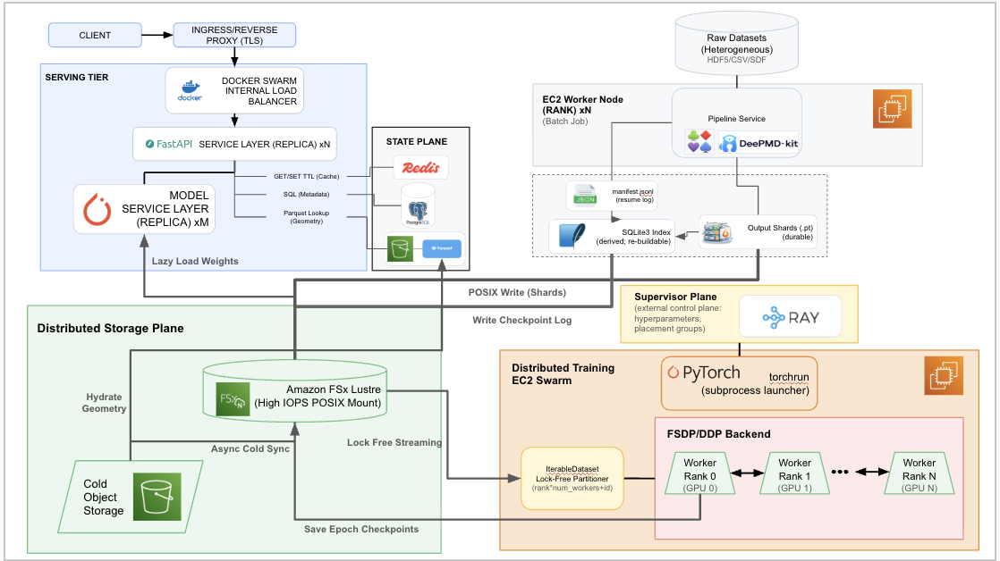

# SpectraLoRA
[](https://doi.org/10.5281/zenodo.19859798)

Post-training compact molecular GNNs for surrogate Raman prediction and post-hoc spectral alignment via structural prompting and derivative-free optimization via evolution strategies.

## Overview

SpectraLoRA adapts a 8M-parameter equivariant molecular GNN model (DetaNet) to predict Hessians, vibrational frequencies, and Raman spectra from 3D atomic coordinates. The model is pre-trained on ~22M molecules from SPICE, NABLA2DFT, QM9, and QM7, then adapted with SO(3)-equivariant LoRA (AdaLoRA for invariant layers, ELoRA for equivariant tensor-product layers). A two-phase post-hoc spectral alignment strategy, supervised pre-training of a 1D U-Net with structural prompting (FiLM conditioning on Morgan fingerprints), followed by Natural Evolution Strategies (NES) to hill-climb the non-differentiable F1 metric, pushes fingerprint F1@15 from 0.426 to 0.532 and peak recall to 0.703, exceeding the in-distribution recall of Mol2Raman (0.634) on a harder out-of-distribution benchmark.

<p align="center">

</p>

## Reproducibility: Demonstration of Prediction & Figures
- To run the prediction system: [](https://colab.research.google.com/drive/11CG3OZeLTPkKlNrVtZSm1U8AFh3XCC2g?usp=sharing)
- To reproduce figures please run the cells in the [Figures Notebook](https://github.com/Arcadia-Science/2026-hp-peptides-ml/blob/main/figures/publication_figures.ipynb) note that you may need git-lfs to get all artifact csv files.


## Full Distributed System



The pipeline is deployed as a four-plane distributed architecture. An Amazon FSx for Lustre parallel file system serves as the shared storage backbone. Ray orchestrates both the offline data-engineering phase (CPU workers featurize heterogeneous molecular sources into sharded PyTorch Geometric graphs using lock-free, shared-nothing SQLite3 indexing) and the distributed training phase (DDP/FSDP jobs with NCCL-based gradient synchronization). Data loading streams pre-sharded, pre-randomized chunks assigned deterministically by GPU rank, trading perfect global shuffle for sustained sequential I/O. Online serving splits into a public FastAPI service (dataset browsing, inference orchestration, Postgres metadata, Redis caching) and a dedicated DetaNet model service with geometries stored in Parquet shards for random access.


## Repository Layout

```
capsule-3259363/          DetaNet model code, weights, LoRA adapters
apps/api/                 Async FastAPI for dataset browsing + inference
apps/model/               Model service (Python 3.8, loads DetaNet)
db/init/                  Postgres schema + partitions
scripts/ingest/           Build Parquet shards + load DB
data-gen-pipeline/        DFT data generation (DeePMD imputation)
ramanchembl_pipeline/     Evaluation, stats, alignment, ES refinement
  artifacts/stats_v2/     Pre-computed CSVs + figures
  alignment_results/      ES refinement checkpoints + eval
  stats_notebook_lib.py   Plotting + analysis library
  stats_v2.ipynb          Main stats notebook (generates paper figures)
paper/                    Manuscript (LaTeX)
  figures/                Paper figures (PNG/PDF/SVG)
```

## Cloning

This repo uses Git LFS for large model checkpoints and data files.

**Full clone (requires [git-lfs](https://git-lfs.com)):**
```bash
git lfs install
git clone https://github.com/Arcadia-Science/2026-hp-peptides-ml
```

**Code-only clone (skip LFS binaries, ~50 MB):**
```bash
GIT_LFS_SKIP_SMUDGE=1 git clone https://github.com/Arcadia-Science/2026-hp-peptides-ml
```
LFS pointer stubs are checked out in place of the actual files. Model weights for inference are available separately on HuggingFace.

## Local Setup

### Install
```bash
pip install -r requirements.txt -f https://data.pyg.org/whl/torch-2.8.0+cpu.html
```

### Build Parquet shards
```bash
python scripts/ingest/build_parquet.py --dataset qm9s --zip capsule-3259363/data/qm9s_csv.zip --out data/processed --shard-size 1000
```

### Start some services
```bash
docker-compose up --build
```

### Run local inference
```bash
curl -X POST "http://localhost:8000/predict/raman" \
  -H "Content-Type: application/json" \
  -d '{"dataset":"qm9s","molecule_id":1}'
```

## Hardware Requirements
- Minimal requirements: Laptop with 16GB of RAM + Docker for local inference on small dataset
- Data Processing: AWS Batch or 3-5x c7a.48xlarge + EKS
- Small Training: 7xp5e.48xlarge + AWS EKS Node group see : [AWS DOCS](https://docs.aws.amazon.com/eks/latest/userguide/machine-learning-on-eks.html)
- Medium Training: 12-15x 5e.48xlarge + AWS EKS
- Large Training: Hyperpod [AWS DOCS](https://aws.amazon.com/sagemaker/ai/hyperpod/)


## Key Results

| Metric | Baseline (raw, OOD) | +ES Refined OOD | Mol2Raman (in-dist) |
|--------|---------------|-------------|---------------------|
| FP F1@15 | 0.426 | 0.532 | 0.631 |
| FP Recall@15 | 0.438 | **0.703** | 0.634 |
| FP Precision@15 | 0.444 | 0.440 | 0.629 |
| Cosine (full) | 0.216 | 0.486 | 0.689 |


## Results Figure
<p align="center">


</p>

